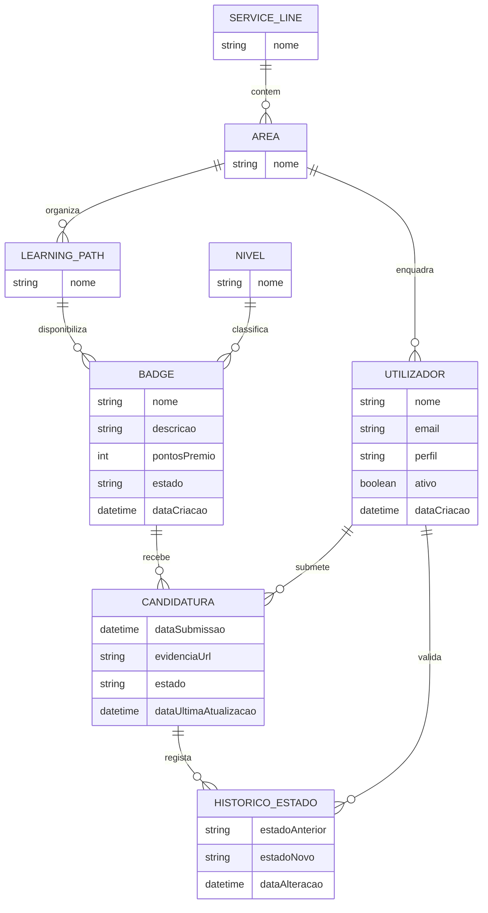

# Modelo conceptual — Softinsa Badges

Este documento descreve o modelo conceptual da base de dados **Softinsa Badges**. O objetivo é representar as entidades principais do domínio, os seus atributos de negócio e as associações entre elas, sem depender de detalhes físicos de implementação.

## Entidades principais

### Nível
Representa o nível de progressão associado a uma badge.

**Atributos:**
- Nome do nível

**Valores previstos:** Júnior, Intermédio, Sénior, Especialista, Líder.

### Service Line
Representa uma linha de serviço da organização.

**Atributos:**
- Nome da service line

### Área
Representa uma área funcional pertencente a uma service line.

**Atributos:**
- Nome da área

### Learning Path
Representa um percurso de aprendizagem existente dentro de uma área.

**Atributos:**
- Nome do learning path

### Badge
Representa uma conquista/credencial que pode ser atribuída no contexto de um learning path e de um nível.

**Atributos:**
- Nome da badge
- Descrição
- Pontos de prémio
- Estado
- Data de criação

**Valores previstos para estado:** Ativo, Inativo.

### Utilizador
Representa uma pessoa que utiliza a plataforma, podendo submeter candidaturas ou validar alterações consoante o seu perfil.

**Atributos:**
- Nome
- Email
- Perfil
- Estado ativo/inativo
- Data de criação

**Valores previstos para perfil:** Administrador, Consultor, Talent Manager, Leader.

### Candidatura
Representa a submissão de um utilizador para obter uma badge.

**Atributos:**
- Data de submissão
- URL da evidência
- Estado
- Data da última atualização

**Valores previstos para estado:** Open, Submitted, Em Validação, Aprovado, Rejeitado.

### Histórico de Estados
Representa o registo das alterações de estado de uma candidatura.

**Atributos:**
- Estado anterior
- Estado novo
- Data da alteração

## Relações e cardinalidades

- Uma **Service Line** pode ter várias **Áreas**; cada **Área** pertence a uma única **Service Line**.
- Uma **Área** pode ter vários **Learning Paths**; cada **Learning Path** pertence a uma única **Área**.
- Uma **Área** pode ter vários **Utilizadores**; cada **Utilizador** pode estar associado a zero ou uma **Área**.
- Um **Learning Path** pode ter várias **Badges**; cada **Badge** pertence a um único **Learning Path**.
- Um **Nível** pode classificar várias **Badges**; cada **Badge** tem um único **Nível**.
- Um **Utilizador** pode submeter várias **Candidaturas**; cada **Candidatura** pertence a um único **Utilizador**.
- Uma **Badge** pode receber várias **Candidaturas**; cada **Candidatura** diz respeito a uma única **Badge**.
- Uma **Candidatura** pode ter vários registos de **Histórico de Estados**; cada registo pertence a uma única **Candidatura**.
- Um **Utilizador** pode validar várias alterações de estado; cada registo de **Histórico de Estados** pode ter zero ou um **Utilizador** validador.

## Diagrama conceptual

## Regras de negócio relevantes

- O email do utilizador deve ser único.
- A combinação entre nome da área e service line deve ser única.
- A combinação entre nome do learning path e área deve ser única.
- A combinação entre nome da badge, learning path e nível deve ser única.
- Os pontos de prémio de uma badge devem estar entre 0 e 1000.
- As candidaturas guardam o estado atual e o histórico permite auditar as mudanças de estado.
